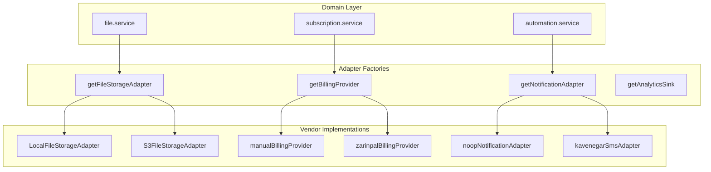

# Provider Adapter Architecture — KesbYar

ساختار adapter-based برای swap کردن vendor بدون churn در domain services.

**مرتبط:** [ADR-008](../decisions/008-integration-adapters.md) · [integration-boundary-rules](./integration-boundary-rules.md)

---

## 1. الگوی معماری



---

## 2. سه قطعه هر integration

### 2.1 Contract (shared)

مسیر: `packages/shared/src/integrations/`

| File | Exports |
|------|---------|
| `categories.ts` | `INTEGRATION_CATEGORIES`, `PROVIDER_IDS` |
| `billing.ts` | `BillingProvider`, `CheckoutSessionRequest`, `PaymentWebhookEvent` |
| `storage.ts` | `FileStorageAdapter`, `FileStorageWriteRequest` |
| `notification.ts` | `NotificationAdapter`, `SendNotificationCommand` |
| `analytics.ts` | `AnalyticsSink`, `AnalyticsEvent` |
| `errors.ts` | `IntegrationFailure`, `normalizeIntegrationError` |
| `selection.ts` | `resolveProviderId`, `PROVIDER_ENV_KEYS` |

**قانون:** contracts بدون `fetch`، بدون `fs`، بدون `process.env` (جز types).

### 2.2 Factory (web server)

یک تابع singleton per category:

```ts
export function getFileStorageAdapter(): FileStorageAdapter
export function getBillingProvider(explicitId?: string): BillingProvider
export function getNotificationAdapter(): NotificationAdapter
export function getAnalyticsSink(): AnalyticsSink
```

- Cache instance در module scope (V1)
- انتخاب provider: [provider-selection-policy](./provider-selection-policy.md)
- post-V1: DI/test override via optional parameter

### 2.3 Implementation (providers/)

```
apps/web/src/server/
  billing/providers/
    manual.ts          ← V1
    zarinpal.ts        ← post-V1
  files/
    storage.adapter.ts ← local + factory
    providers/s3.ts    ← post-V1 (optional split)
  notifications/
    notification.adapter.ts  ← factory + sendNotification()
    providers/kavenegar.ts   ← post-V1
    providers/resend.ts      ← post-V1
```

---

## 3. AI — استثنای مستند

AI دو لایه دارد (ADR-015):

| لایه | مسیر | نقش |
|------|------|-----|
| Contracts | `packages/shared/src/types/ai.ts` | DTO بین web و FastAPI |
| Transport | `apps/web/src/lib/ai/client.ts` | HTTP، retry، timeout |
| Domain | `server/intelligence/intelligence.service.ts` | snapshot + fallback |

FastAPI خودش adapter به model provider آینده است — **خارج از** `apps/web`.

→ [AI_INTEGRATION.md](../AI_INTEGRATION.md)

---

## 4. نمونه پیاده‌سازی: Storage

**Contract:**

```ts
interface FileStorageAdapter {
  readonly id: string;
  write(params: FileStorageWriteRequest): Promise<FileStorageWriteResult>;
  remove(storagePath: string): Promise<void>;
}
```

**Domain (`file.service.ts`):**

- validation MIME/size (domain)
- `getFileStorageAdapter().write({ organizationId, fileName, bytes, mimeType })`
- Prisma `FileAttachment` با `storagePath` opaque

**Adapter (`storage.adapter.ts`):**

- path traversal guard (vendor-agnostic security)
- local FS یا S3 SDK

---

## 5. نمونه پیاده‌سازی: Billing

**Contract:**

```ts
interface BillingProvider {
  readonly id: string;
  createCheckoutSession(params: CheckoutSessionRequest): Promise<CheckoutSessionResult>;
  parseWebhook?(payload: unknown): Promise<PaymentWebhookEvent | null>;
}
```

**Domain (`subscription.service.ts`):**

- plan change logic، trial، audit
- V1: `provider: 'manual'` — بدون redirect

**Adapter (`manual.ts`):**

- `checkoutUrl: null`, `status: 'manual'`

---

## 6. نمونه پیاده‌سازی: Notifications

**Contract:**

```ts
interface NotificationAdapter {
  readonly id: string;
  readonly supportedChannels: readonly ('sms' | 'email')[];
  send(command: SendNotificationCommand): Promise<NotificationDispatchResult>;
}
```

**V1 noop adapter:**

- `status: 'queued'` — defer تا provider واقعی
- log `notification.queued`

**Automation wiring (آینده):**

```ts
// automation.service applyAction SEND_REMINDER
await sendNotification({
  organizationId,
  channel: 'sms',
  recipient: user.mobile,
  body: payload.description ?? payload.title,
});
```

---

## 7. Analytics sink

Fire-and-forget — **هرگز throw نکند**.

```ts
trackProductEvent({
  name: 'feature.used',
  organizationId,
  properties: { feature: 'export' },
});
```

V1: `LogAnalyticsSink` → structured log `kind: 'metric'`.

---

## 8. ERP / accounting connectors (آینده)

پیشنهاد مسیر:

```
packages/shared/src/integrations/erp.ts   ← ErpSyncAdapter contract
apps/web/src/server/erp/
  erp.adapter.ts
  providers/sepidar.ts
```

Contract sketch:

- `pushInvoice(domainInvoice) → ErpSyncResult`
- `pullCatalog() → NormalizedProduct[]`
- id map table: `erpExternalId` در Prisma

---

## 9. فایل‌های مرجع فعلی

| Category | Factory | Implementation |
|----------|---------|----------------|
| Storage | `server/files/storage.adapter.ts` | `LocalFileStorageAdapter` |
| Billing | `billing/providers/manual.ts` | `manualBillingProvider` |
| Notification | `server/notifications/notification.adapter.ts` | `NoopNotificationAdapter` |
| Analytics | `lib/analytics/analytics.adapter.ts` | `LogAnalyticsSink` |
| AI | `lib/ai/client.ts` | FastAPI HTTP |

---

## 10. Mocking در تست

```ts
// pattern for future integration tests
vi.mock('@/server/files/storage.adapter', () => ({
  getFileStorageAdapter: () => ({
    id: 'test',
    write: async () => ({ storagePath: '/tmp/test' }),
    remove: async () => {},
  }),
}));
```

Domain tests mock factory — not vendor HTTP in service files.
